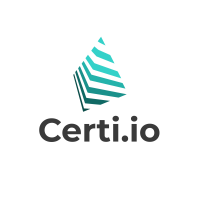

# Certi Dapp 

Use the Celo Blockchain as a digital signature to authenticate documents, anyone with the original document can validate it and add its signature. Just connect to our D-app and be your own notary. [break changes](https://docs.metamask.io/guide/provider-migration.html#table-of-contents) in metamask provier API in January of 2021.

This project is created using [NodeJS](https://nodejs.org/) running on [Express server](https://expressjs.com/) and using [hbs](https://www.npmjs.com/package/hbs) template engine.

Using [Ethers.JS](https://docs.ethers.io/) library for the dapp connection with metamask wallet. 

## Prerequisite
* NodeJS installed on system
* [Metamask](https://docs.metamask.io/) - browser extension
* Account in metamask wallet

## Installation
Clone the repository and run the below commands.

`npm install`

`npm run dev` or `npm run start`

The node application will be running on express server on port 3000 or given port.

Open browser and type url **127.0.0.1:3000/**

## License
[Copyright © JuniorCalle](/LICENSE)
